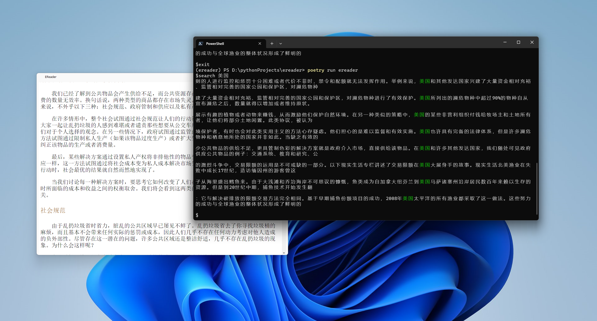

# Install & Usage


```
pip install git+https://github.com/aoout/ereader.git@master
ereader --help
```

```
ereader --epubPath="D:\14777\Books\宇航服防尘指南.epub" --fontFamily=LXGW WenKai --fontSize=28
```

# Screenshot


# RoadMap

- [x] shortcut keys
- [x] more shortcut keys
- [x] picture support
- [x] inline link support
- [x] bookmark support
- [x] record reading progress
- [x] more cli parameter
- [ ] epub data cache(not urgent)
- [ ] book management(just cli)(not urgent)
- [x] a shell
- [ ] some online support, like douban

# Bug

- [x] resume progress on short pages
- [ ] contextmenu break tocwidget mechanism

# About the Shell

Run ereader, and enter the ereader's shell.

You can run `ereader --help` to get the help info.

